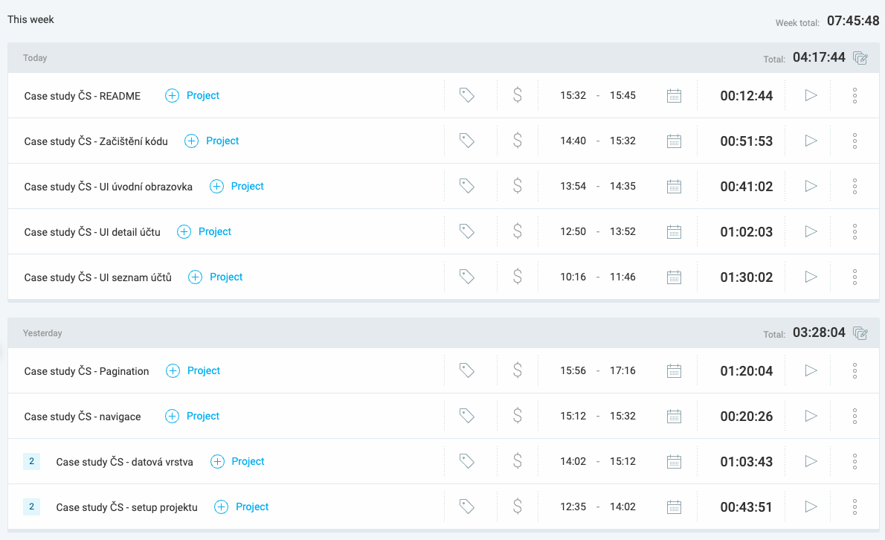

# Transparents
Android application to present and explore transparent accounts provided by [**Transparent accounts API**](https://developers.erstegroup.com/docs/apis/bank.csas/bank.csas.v3/transparentAccounts). This project was created as a homework for Česká spořitelna job application and developed solely by Patrik Mokriš.

## Specification
- Android Application written in Kotlin, built with Gradle, uses Clean+MVVM architecture, Single Activity
- Targets API 36, Min. 28, Kotlin 2.2.0
- Technologies: Jetpack Compose (UI+Navigation), Koin, Retrofit+Gson, Lottie
- Three screens: Home (Introduction), Accounts list (Paginated list with expandable items), Account detail (Full data presented with copy to clipboard function)
- Used vectors are from https://www.flaticon.com/, https://lottiefiles.com/featured-free-animations (under free licence)
- Time limit: 8 hours, Built from scratch

## How to build
1. Clone the project
2. In project root folder, find or create `local.properties` file and append API Key entry (generation is described on portal of the API documentation) like this:
```
API_KEY=VALUE
```
3. Build the application in Android Studio or by using :
```
./gradlew assembleDebug
```

## Logged hours


